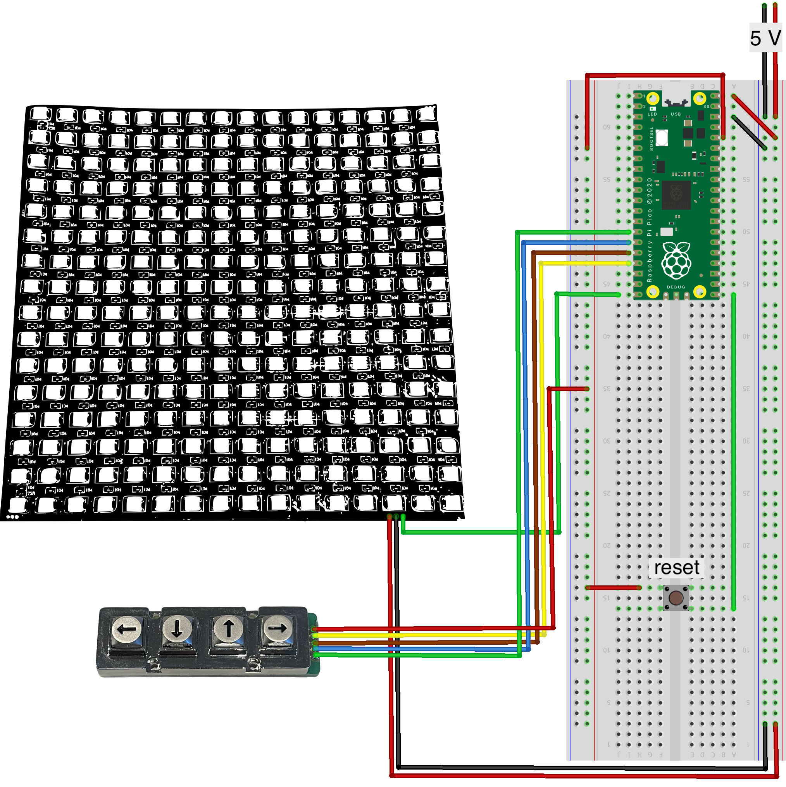

# snake

A snake game for the Raspberry Pi Pico written in ARM assembly.

### Demo video


https://github.com/leksiso/snake/assets/68514429/f8af3ccf-473f-46bc-9c08-5a1de3f3102e


### Hardware parts



* Raspberry Pi Pico
* [16x16 pixel ws2812b LED matrix](https://www.miniinthebox.com/p/ws2812b-rgbic-5050smd-led-matrix-panel-256-pixels-individually-addressable-programmable-digital-led-display-matrix-panel-flexible-fpcb-for-arduino_p9086504.html)
* [Arrow keypad](https://www.tme.eu/en/details/ab104-mars-wp/metal-keypads/accord/ak-104-ar-ssb-wp-mm/)
* Push button
* Jumper wires

### How to build

The project is built with cmake using the method described in
[Getting started with Raspberry Pi Pico](https://datasheets.raspberrypi.com/pico/getting-started-with-pico.pdf).

That is, by running the following commands:

```
mkdir build
cd build
export PICO_SDK_PATH=<path-to-pico-sdk-here>
cmake ..
cmake --build .
```
